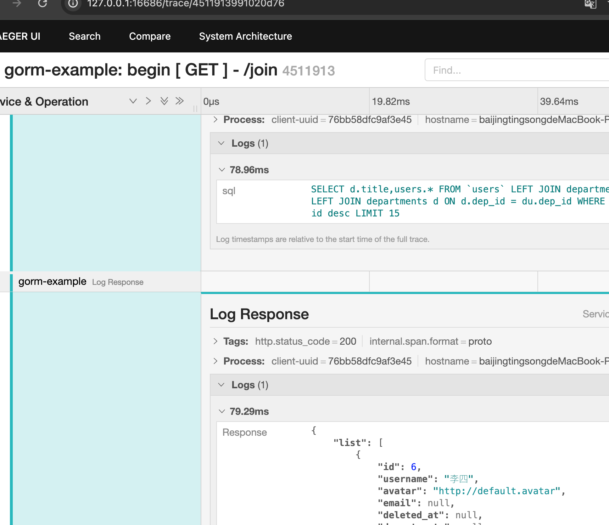

# GORM 基础使用例子

> 前因:之前在V2EX，看到一篇帖子,[https://www.v2ex.com/t/859178](https://www.v2ex.com/t/859178) ,是来吐槽`go`的ORM框架
> [gorm](https://github.com/go-gorm/gorm) 难用，然后帖子讨论后期就跑偏了。
> 但是我现在用了`GORM`有一段时间了，感觉也没那么难用，只是感觉`GORM`文档的例子，太简洁了，不够全，导致很多人用起来很不顺手，所以我想
> 把我使用的例子分享出来，给大家参考。

### 演示功能

- [x] model的tag编写格式。
- [x] 数据库迁移以及维护，主要使用`sql-migrate`,具体使用见[这里](./migrate/README.md)。
- [x] 常见查询分页，以及规范建议。[见这里](./logic/README.md)
- [x] 基础配置文件加载。
- [x] Jaeger链路追踪,显示SQL操作顺序,以及请求参数和响应参数。

### 项目结构设计

<details>
<summary>结构设计建议</summary>

一般`Web`项目，比如`Java`会分为三层。
```
DAO层:
    DAO层叫数据访问层，全称为data access object，属于一种比较底层，比较基础的操作，具体到对于某个表的增删改查，
    也就是说某个DAO一定是和数据库的某一种表一一对应的，其中封装了增删改查基本操作，建议DAO只做原子操作，增删改查
    
Service层:
    Service层叫服务层，被称为服务，粗略的理解就是对一个或多个DAO进行的再次封装，封装成一个服务，所以这里也就不会是一个原子操作了，需要事务控制

Controller层:
    Controller负责请求转发，接受页面过来的参数，传给Service处理，接到返回值，再传给页面。
    controller层一般会和前台的js文件进行数据的交互， controller层是前台数据的接收器，后台处理好的数据也是通过controller层传递到前台显示的。
```

在此演示项目中

```
DAO层 对应 Model层

Service层 对应 Logic层(我认为叫逻辑层更合理，在这层组装各种业务逻辑)

Controller层 可以自行根据web框架在对应路由操作下添加。
```

</details>

### 操作体验

> 特别是`Preload`，刚开始接触时，特别不理解这个方法，直接实际上数据更好理解。
我在`02_migrate/mysql/20220626_init.sql`文件里面，加入一些`insert`语句，方便各种GORM操作直观的体现数据查询结果。

- 1 安装环境,迁移生成表
> 配置 `config/config.yaml`信息(.yaml结尾的配置文件一般都会设置git忽略，不上传
只留下一个.yaml.example格式例子文件)。并且在数据库创建名为`example`的数据库
```
go mod tidy
```
迁移见[sql-migrate](./migrate/README.md)

- 2 启动
```
# 项目根目录下
go run main.go
```
建议浏览器安装`JSON-handle`查看，查看接口JSON结果更方便。


- 3 Jaeger链路追踪
```
# 需要docker安装Jaeger

docker run -d --name jaeger \
  -e COLLECTOR_ZIPKIN_HOST_PORT=:9411 \
  -p 5775:5775/udp \
  -p 6831:6831/udp \
  -p 6832:6832/udp \
  -p 5778:5778 \
  -p 16686:16686 \
  -p 14268:14268 \
  -p 14250:14250 \
  -p 9411:9411 \
  jaegertracing/all-in-one:1.22
  
```
> 装好后访问，用接口响应中的traceID查询请求。

- http://127.0.0.1:16686/search

方便追踪请求，效果图如下

